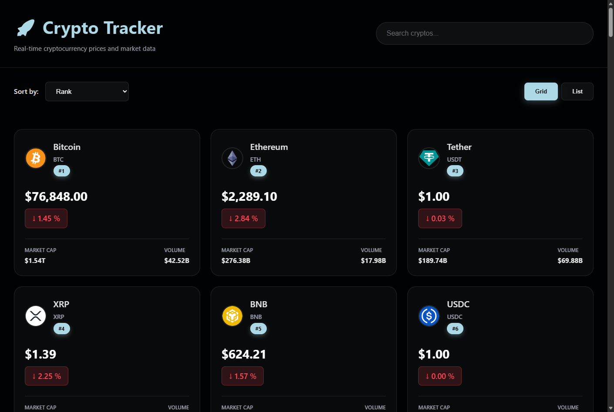

# 💰 Crypto Tracker

> 📊 Cryptocurrency price tracker that fetches real-time data from the CoinGecko API. Third and final project from the [Build 3 React Projects in 4 Hours](https://www.youtube.com/watch?v=r47C9c4qCqE) tutorial.

## 📸 Preview

## 🚀 [Live Demo](your-render-url-here)

## 🎯 Learning Objectives

This project was built to practice API integration and advanced React patterns:

- ✅ **External API integration** - Fetching data from CoinGecko API
- ✅ **useEffect with dependencies** - Re-fetching data on interval
- ✅ **Custom API layer** - Separating API calls from components
- ✅ **React Router** - Navigation between list and detail pages
- ✅ **Dynamic routing** - `/coin/:id` with URL parameters
- ✅ **useParams hook** - Extracting URL parameters
- ✅ **Number formatting** - Currency and percentage formatting utilities
- ✅ **Loading states** - Handling async data gracefully

## 🛠️ Technologies

| Technology | Description |
|------------|-------------|
| **React 18** | UI library with hooks |
| **Vite** | Fast build tool |
| **JavaScript** | Application logic |
| **CSS3** | Custom styling |
| **React Router** | Client-side routing |
| **CoinGecko API** | Free cryptocurrency data |
| **Axios** | HTTP client for API calls |

## 🎮 Features

- 📈 Real-time cryptocurrency prices
- 🔍 Top 50 coins by market cap
- 📊 Price change percentages (24h)
- 🪙 Detailed coin view with market data
- 💵 Prices in USD with proper formatting
- 🔄 Auto-refreshing data